# Rock Paper Scissors

The Rock Paper Scissors app is a simple game designed for children and young adults. The main purpose of this app is entertainment.

The game is short, simple, and light-hearted. It consists of 3 rounds. Each round, the user must click one of three options: Rock, Paper, or Scissors. Rock beats Scissors. Scissors beats Paper. Paper beats Rock. To win the game, the user must beat the computer twice.

The site can be accessed by this [link](https://kelseyjaneadams.github.io/rock-paper-scissors/).

[IMAGE]

## User Stories

### First Time Visitor Goals:
* As a First Time Visitor, I want to easily understand the purpose of the app.
* As a First Time Visitor, I want to be able to easily navigate through the app, so I can find the content.
* As a First Time Visitor, I want to learn how to play the game with clear and concise rules.
* As a First Time Visitor, I want to begin a game easily.

### Returning Visitor Goals:
* As a Returning Visitor, I want to quickly start a new game, so I can begin playing without needing to review the instructions.
* As a Returning Visitor, I want to enjoy the challenge and engagement, so I can stay entertained by playing multiple rounds.
* As a Returning Visitor, I want to navigate the game interface efficiently, so I can make selections quickly and easily.

### Frequent Visitor Goals:
* As a Frequent Visitor, I want to quickly access the game and start playing, so I can enjoy my favorite game without any delays.
* As a Frequent Visitor, I want to navigate the interface effortlessly, so I can quickly make my moves and enjoy a smooth gaming experience.

## Features

### Menu Page
* The menu page is featured in the top middle of the page and represents the main goal of the application.
* The menu page provides two options for the user to choose from.

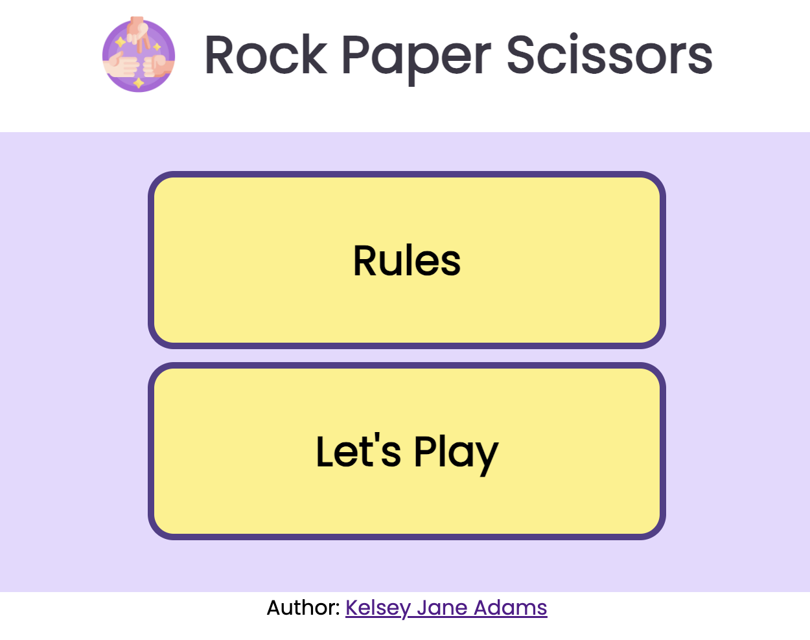

The menu page consists of two buttons:
* A Rules button which opens a pop-up div with an explanation of the game rules.
* The Rules button, once clicked, changes to a Hide Rules button so the user can click to hide the rules.

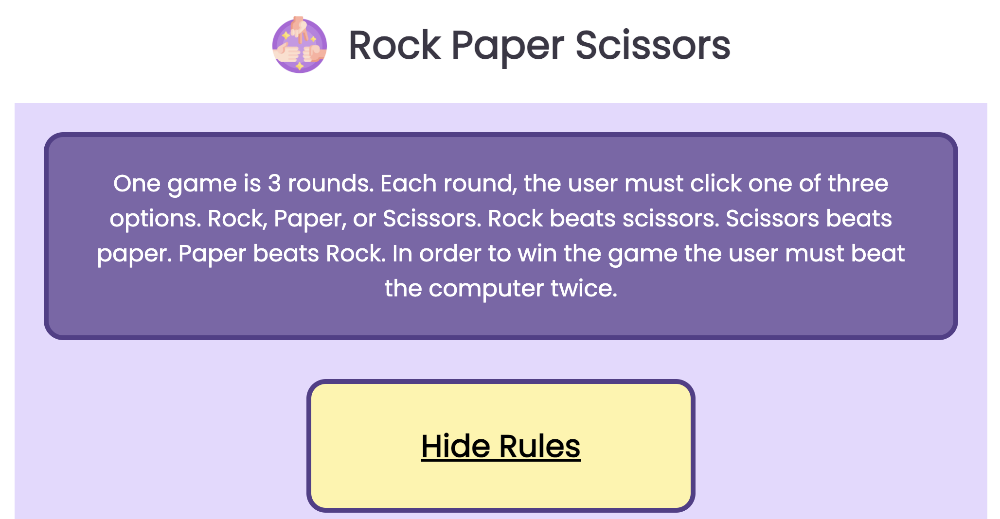

* A Let's Play button which takes the user to the game area.

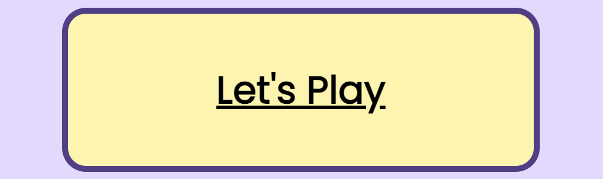

## Game Section
* The game section consists of the results area, the user's choice selection, and the play buttons.

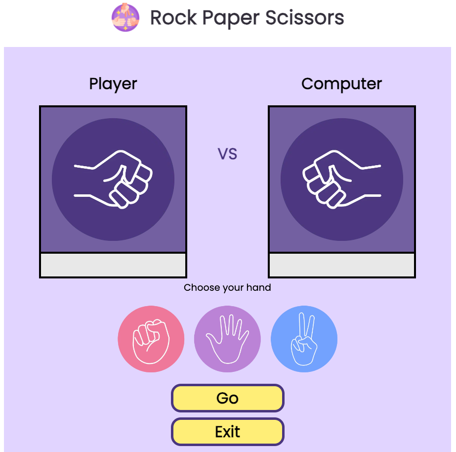

### Results Area
* The Results Area consists of two square display screens - one for the user and one for the computer. The screens start with a matching image of a closed fist to communicate to the user that no hand has been played.

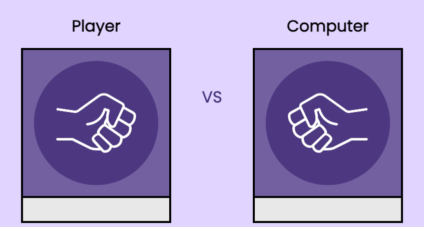

* The Player screen is where the user's option will be displayed when they play their hand.
* The Computer screen is where the computer's option will be displayed when it plays its hand.

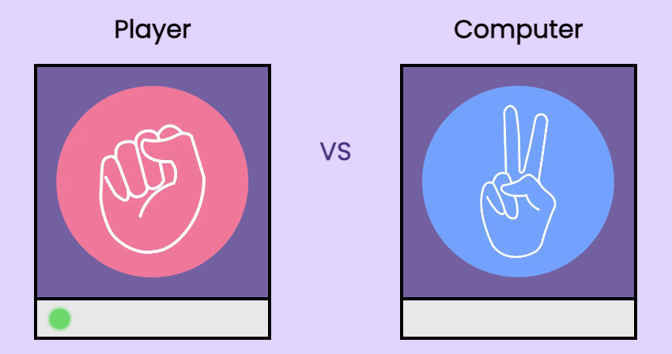

### Score Bar
* The Score Bar is designed to light up like an LED green light when a round is won.

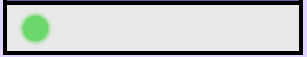

* Since the game is three rounds, when a user wins two rounds they win the game - like traditional Rock Paper Scissors, it's the best two out of three.
* If the round is a draw, this will be communicated in the middle of the results screens with the text 'Draw!'.

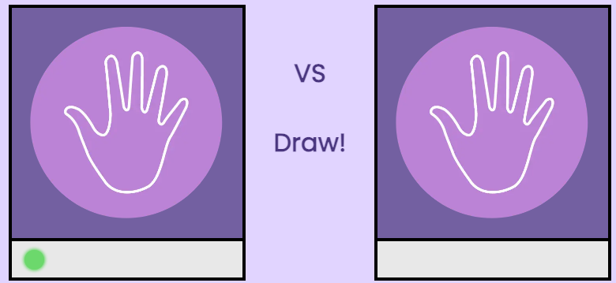

### Result Announcement
* A modal window will open at the end of the game. This modal will display whether the user won or lost the game.

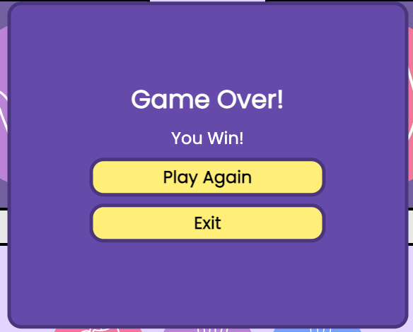

* The modal has two buttons for the user to choose between:
  * A play again button. If the user clicks this button, they will return to the game area which resets for a new game.

  * An exit button. If the user clicks this button, they will return to the menu page.

## User Selection
* The user selection consists of three clickable images of each hand to play in the game: Rock, Paper, Scissors.
* This is followed by two game buttons.

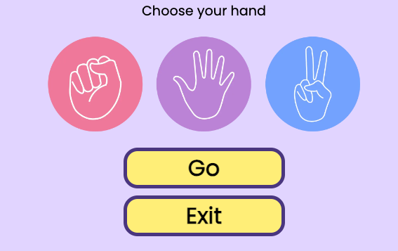

* Once the user clicks on the hand they want to select, a purple border will appear to indicate that their option has been selected. They can change their option by simply clicking on a different hand.

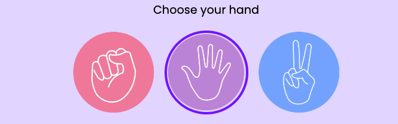

* To play their hand, the user must click the go button underneath the user options. This will begin the round.

* The exit button allows the user to exit the game at any time during play. Once clicked, this will return the user to the menu page.

* If the user clicks the go button without selecting an option, a red border will appear around all three options and the text 'Choose your hand' will also turn red to indicate that they still need to select an option.

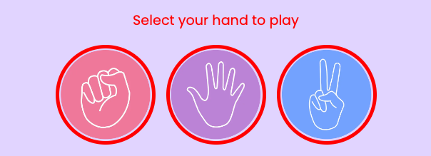

## Technologies Used
- [HTML](https://developer.mozilla.org/en-US/docs/Web/HTML) - was used as the foundation of the site.
- [CSS](https://developer.mozilla.org/en-US/docs/Web/css) - was used to add the styles and layout of the site.
- [CSS Flexbox](https://developer.mozilla.org/en-US/docs/Learn/CSS/CSS_layout/Flexbox) - was used to arrange items on the page and to make pages responsive.
- [VSCode](https://code.visualstudio.com/) - was used as the tool to write and edit code.
- [Git](https://git-scm.com/) & [Gitpod](https://www.gitpod.io/) - was used for the version control of the website.
- [GitHub](https://github.com/) - was used to host the code of the website. 
- [CloudConvert](https://cloudconvert.com/webp-converter) - was used to convret all images on the site into webp.

## Design

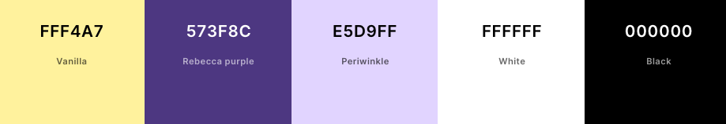

* Vanilla - A soft, neutral background for buttons that makes other colors stand out and provides a friendly, approachable atmosphere.
* Rebecca Purple - Adds fun and whimsy, making important elements pop. It's bold and engaging, enhancing the playful nature of the game.
* Periwinkle -  A soothing color that balances well with Rebecca Purple, making the game inviting and less aggressive.
* White - Ensures readability and clarity, providing a clean contrast against darker colors for easy navigation.
* Black - Offers strong contrast and definition, making important elements easily distinguishable and adding structure to the design.

## Typography 

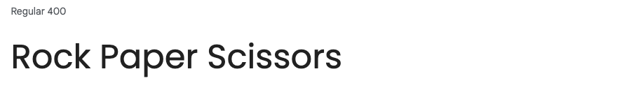

- Poppins Regular 400 was used throughout the entire app for creating a cohesive, readable, and visually appealing experience that complements the playful yet straightforward design of the Rock Paper Scissors game.

## [Wireframe](documentation/images/wireframes.jpeg)

## Testing
## Deployment
### Deployment to GitHub Pages
The site was deployed to GitHub pages. The steps to deploy are as follows:
- In the [GitHub repository](https://github.com/kelseyjaneadams/rock-paper-scissors), navigate to the Settings tab
From the source section drop-down menu, select the Main Branch, then click "Save".
- The page will be automatically refreshed with a detailed ribbon display to indicate the successful deployment.

The live link can be found [here](https://kelseyjaneadams.github.io/rock-paper-scissors/)

### Local Deployment

In order to make a local copy of this project, you can clone it. In your IDE Terminal, type the following command to clone my repository:

- `git clone https://github.com/kelseyjaneadams/rock-paper-scissors.git`

## Future Improvements

* I would like to improve the styling of the menu page and make it more visually appealing. 

## Media

All images used for the application were taken from Canva.

## Tools 
- [cooler](https://coolors.co/) was used to create the colour palette.
- [CloudConvert](https://cloudconvert.com/webp-converter) - was used to convret all images on the site into webp.

## Acknowledgements

- [Lulia Konovalova](https://github.com/IuliiaKonovalova), my mentor provided essential feedback and guidance throughout our sessions, significantly contributing to the progress and completion of my project.
- [Guheshwara](https://www.instagram.com/guheshwara_/), my husband and coding buddy, for keeping me calm and sane, for testing the site and for explaining best practices that I wasnt aware of as a developer. 
- [Code Institute](https://codeinstitute.net/) tutors and Slack community for their support and help with any technical issues experienced.
- [DevelopedByEd](https://www.youtube.com/@developedbyed) For his JavaScript tutorials.

