## Compatability 

In order to confirm the correct functionality, responsiveness, and appearance:

The website was tested on the following browsers: Chrome, Firefox, Safari.

- Chrome:

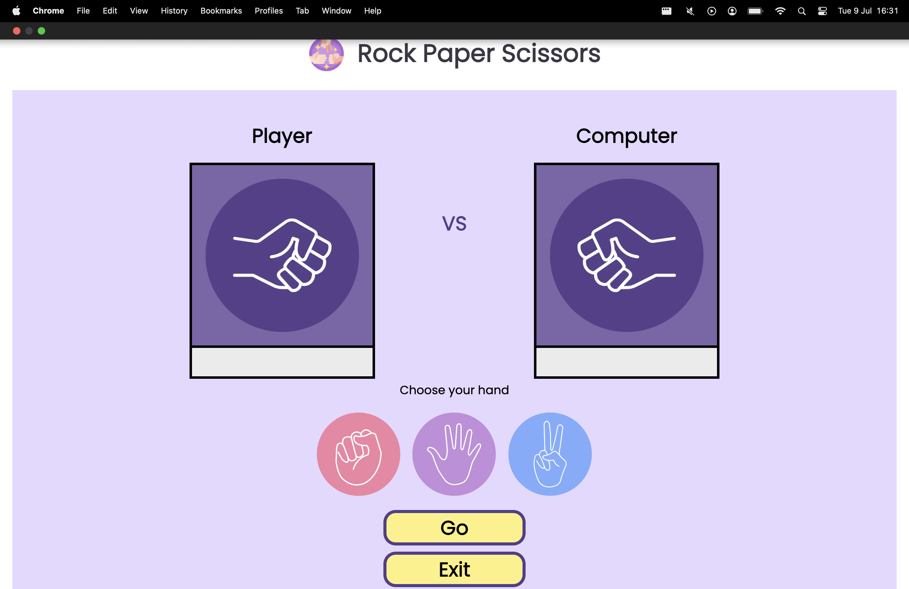

- Firefox:

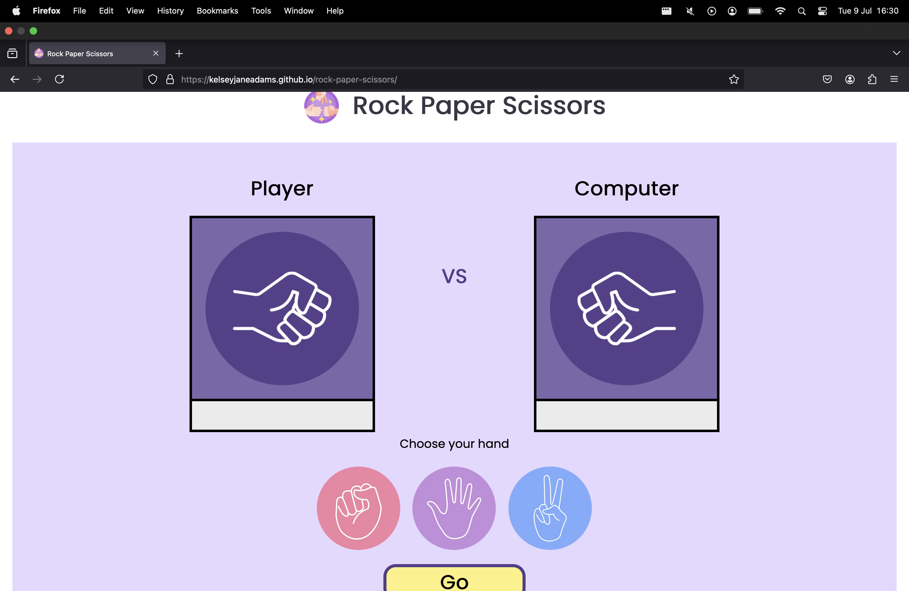

- Safari: 

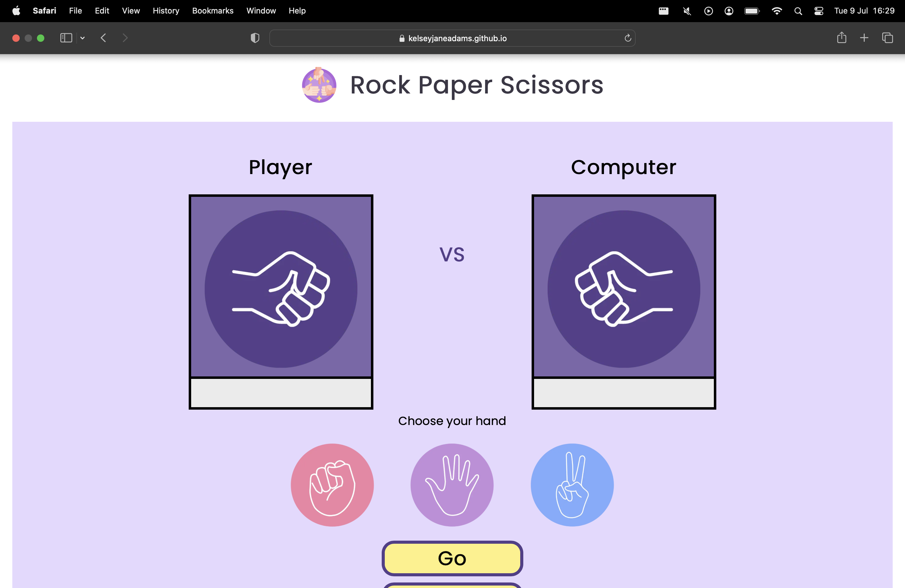

## Responsiveness 

- The website was checked by devtools implemented in Chrome an Firefox browsers.

## Menu Page

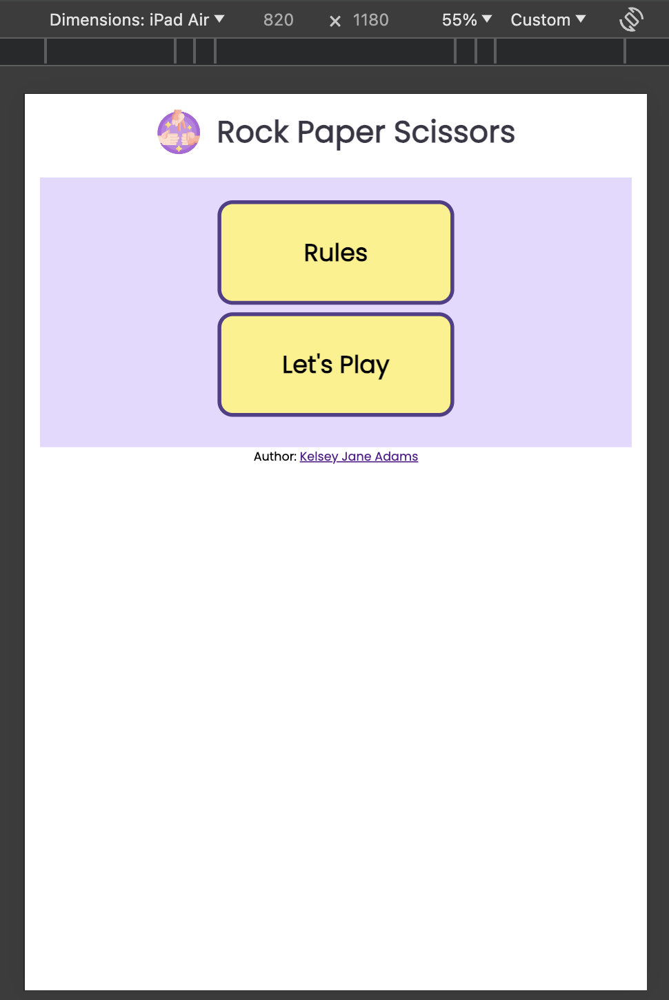
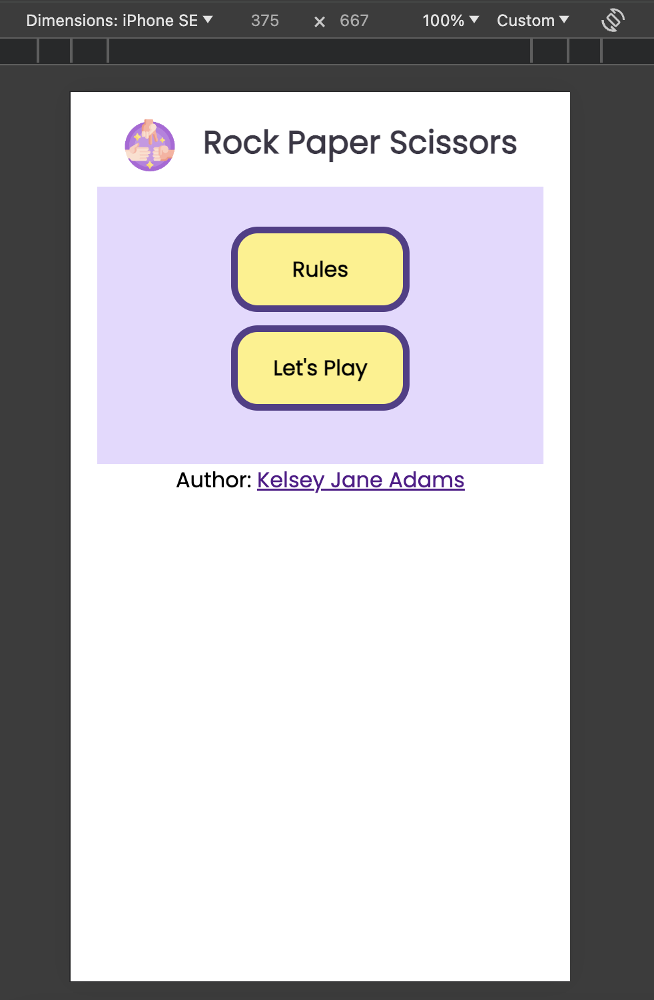

## Game Area

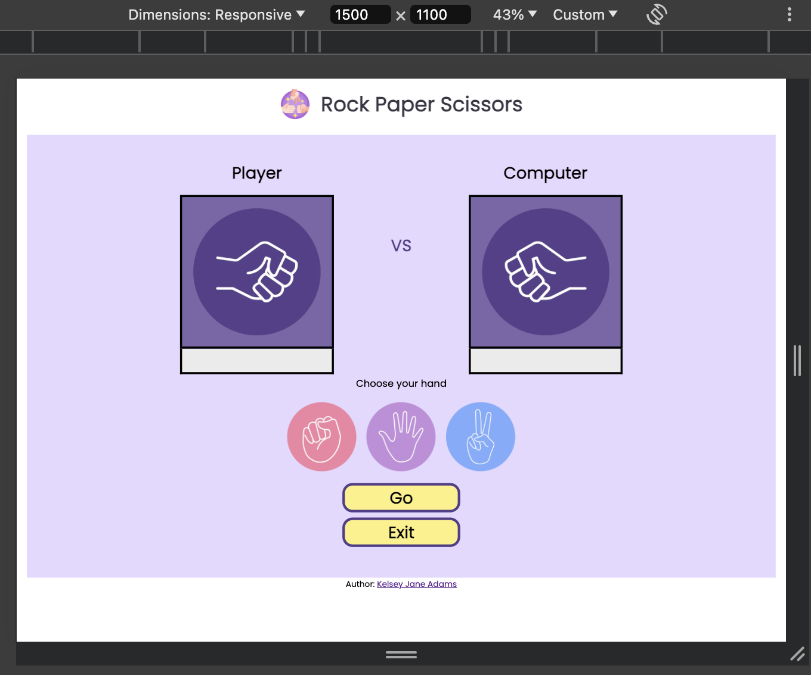
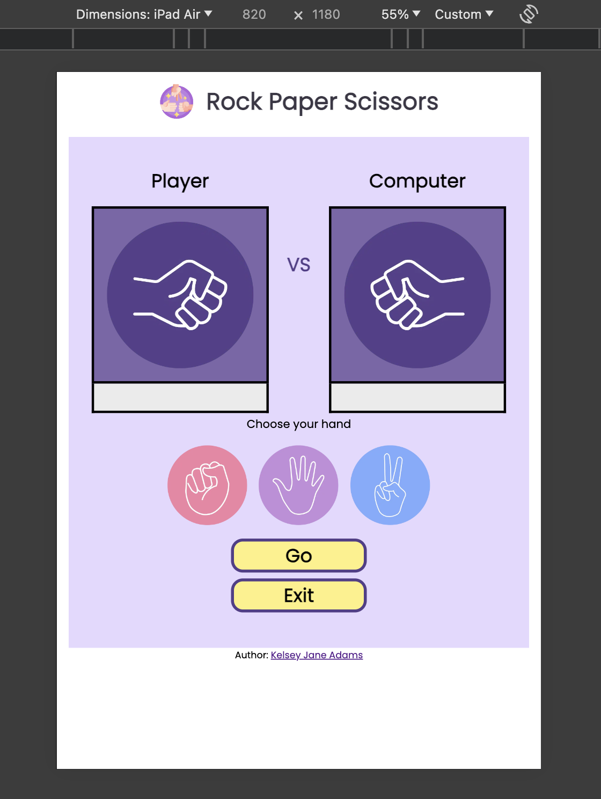
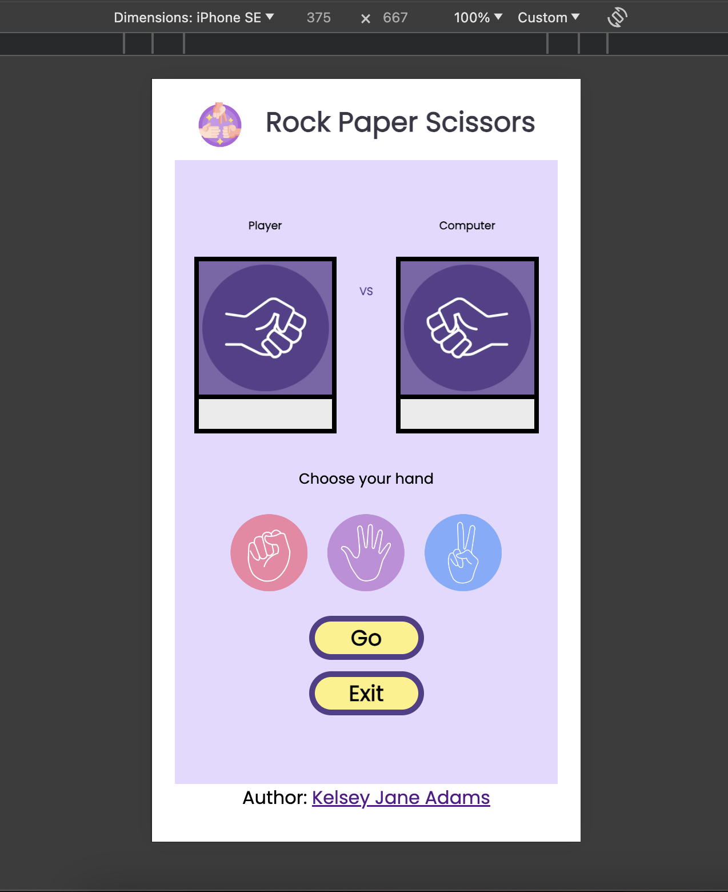

- This website was checked with [Responsive Website Design Tester.](https://responsivedesignchecker.com/checker.php?url=https%3A%2F%2Fkelseyjaneadams.github.io%2Frock-paper-scissors%2F&width=1400&height=700)

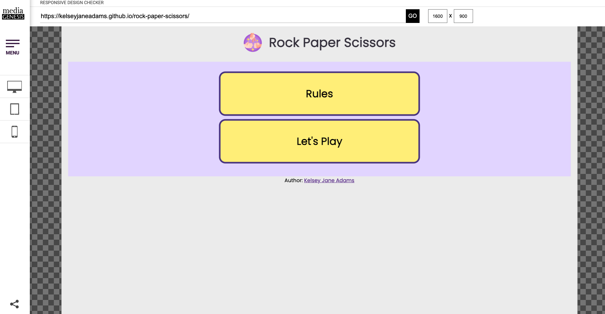
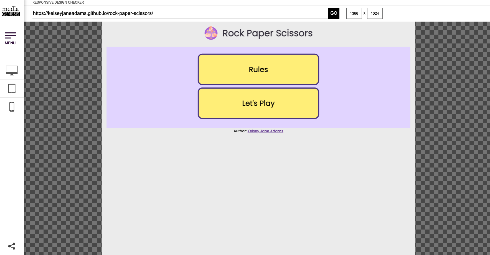
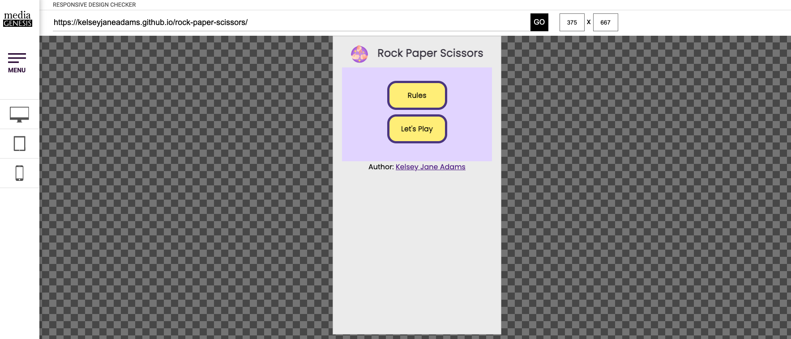

## Validator Testing
### HTML
- No errors or warnings were found when passing through the official W3C validator.
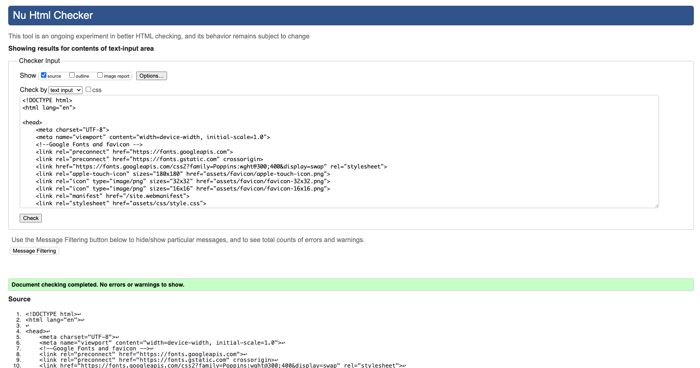

### CSS
- No errors or warnings were found when passing through the official W3C validator.
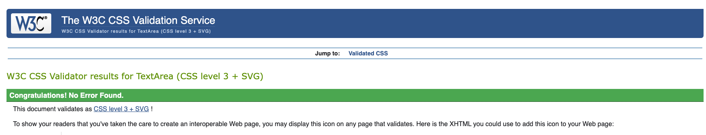

### JavaScript
- No errors or warnings were found when passing through the official JSHint validator except the warnings relating to the 'const'.
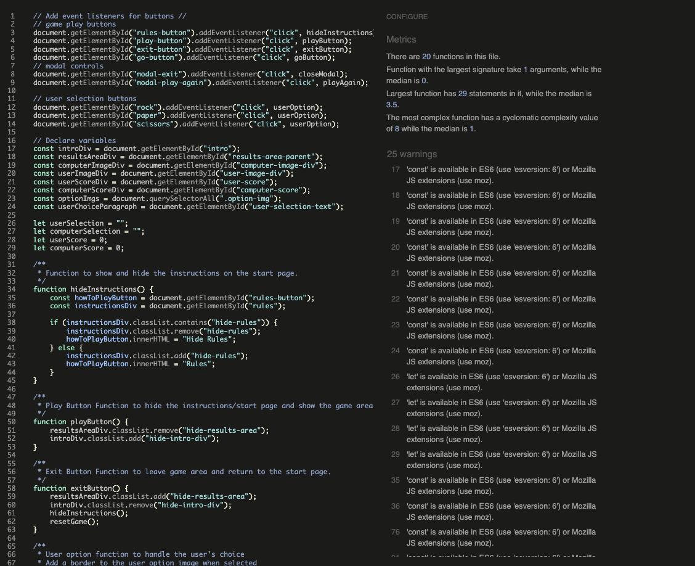

## Accessibility and Performance
- Using lighthouse in devtools I confirmed that the website is performing well, accessible and colors and fonts chosen are readable.

## Bugs
### Solved Bugs

1. The 'Go' button when selected still plays the game even if a user has not selected an option.

*Solution: Added a conditional statement to the goButton function that confirms the computer and user selections have a value before running the game*

2. Images in the results area where not clearing inbetween rounds, nor when play again or exit are clicked.

*Solution: In resetGame function I set the computer and user image back to an empty string to clear image.*

### Unsolved Bugs
None

